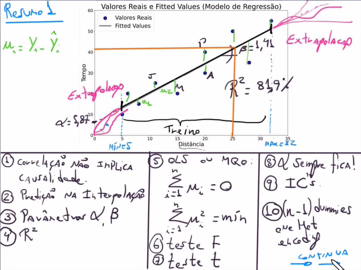
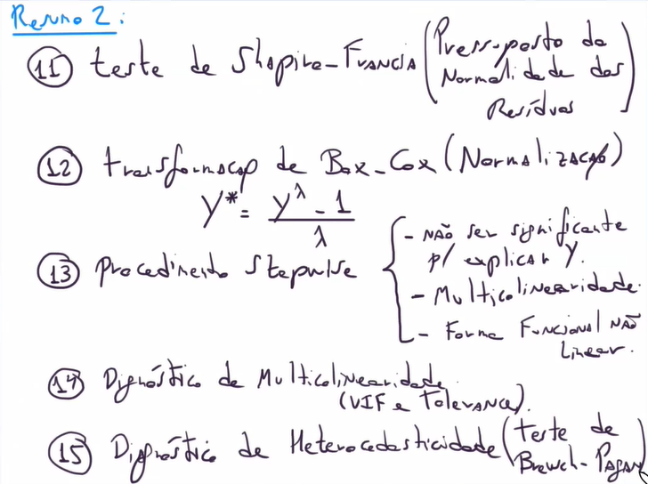
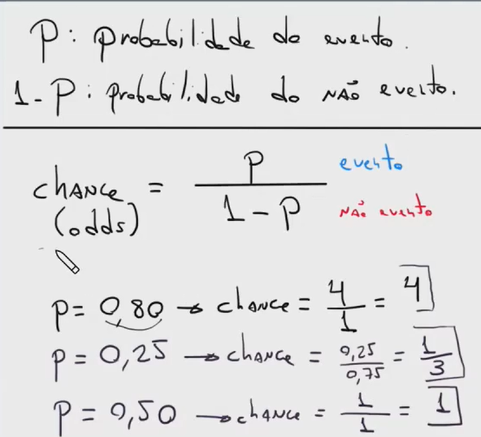
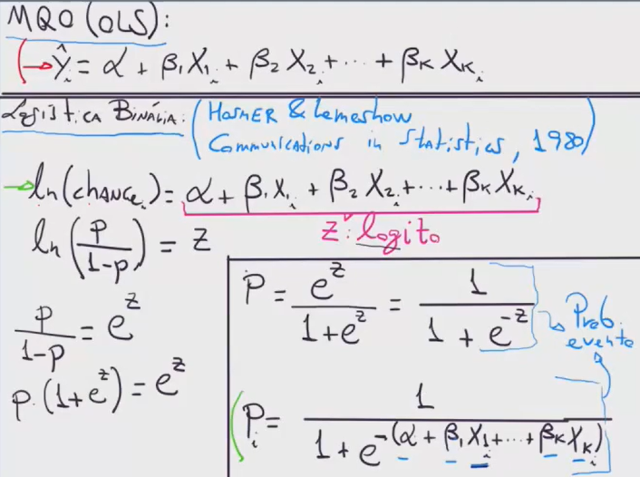

# Regressão Linear

*Importância da remoção de variáveis sem significância estatística:*

Excluir variáveis sem significância estatística em um modelo de regressão linear, mesmo que o \( R^2 \) diminua, é importante por algumas razões principais:

### 1. **Multicolinearidade e Estabilidade do Modelo:**
   Variáveis não significativas podem estar correlacionadas com outras variáveis explicativas (multicolinearidade), o que pode gerar instabilidade no modelo. Isso significa que pequenos desvios nos dados podem causar grandes mudanças nos coeficientes estimados. Ao remover essas variáveis, o modelo tende a ser mais robusto e os coeficientes se tornam mais confiáveis.

### 2. **Simplicidade e Interpretabilidade:**
   Modelos mais simples e com menos variáveis são mais fáceis de interpretar e entender. Se uma variável não é estatisticamente significativa, ela não contribui para explicar a variação da variável dependente de forma confiável. Mantê-la pode criar a ilusão de que ela tem um impacto relevante, dificultando a compreensão dos resultados.

### 3. **Evitar Overfitting:**
   Incluir variáveis irrelevantes aumenta o risco de overfitting, o que significa que o modelo pode se ajustar muito bem aos dados de treinamento, mas generalizar mal para novos dados. Remover variáveis sem significância ajuda a construir um modelo que tenha melhor capacidade de generalização.

### 4. **Significância Estatística e Inferências:**
   Variáveis sem significância estatística têm coeficientes que não são significativamente diferentes de zero, indicando que não há evidência suficiente de que elas afetam a variável dependente. Se a meta é fazer inferências sobre quais fatores influenciam o resultado, manter variáveis irrelevantes pode levar a conclusões erradas.

### 5. **Redução de Ruído:**
   Manter variáveis sem significância adiciona ruído ao modelo. Essas variáveis não contribuem de forma significativa para prever a variável dependente, mas podem introduzir variações que dificultam a identificação das relações reais.

---

Apesar de a remoção de variáveis não significativas às vezes resultar em uma queda no \( R^2 \), isso ocorre porque o \( R^2 \) reflete apenas o ajuste global do modelo aos dados, incluindo variáveis irrelevantes que podem aumentar artificialmente o valor. No entanto, o objetivo é ter um modelo parsimonioso, onde as variáveis incluídas tenham um impacto real, e não maximizar o \( R^2 \) a todo custo.

## Resumo Sobre Modelos Lineares e Não Lineares GLM (4 primeiras aulas)

### Problema de Ponderação Arbitrária na Estimação de Parâmetros em Modelos de Machine Learning

O problema de **ponderação arbitrária** na estimação de parâmetros em modelos de Machine Learning refere-se a uma prática onde pesos são atribuídos de maneira não justificada ou inadequada às variáveis ou instâncias de um modelo. Isso pode ocorrer em duas situações principais:

#### 1. Ponderação de Variáveis (Feature Weighting)
Ao atribuir pesos arbitrários às variáveis do modelo, o impacto de cada variável nas previsões pode ser distorcido. Isso ocorre quando o modelo ou o processo de otimização não justifica esses pesos com base nos dados. O resultado pode ser um modelo com **overfitting** (quando alguns atributos têm peso exagerado) ou **underfitting** (quando pesos adequados não são atribuídos a variáveis relevantes).

#### 2. Ponderação de Amostras (Sample Weighting)
No aprendizado supervisionado, as amostras podem ser ponderadas para dar mais importância a certos exemplos. Isso é comum em contextos como **dados desbalanceados**, onde uma classe minoritária precisa de maior peso para ser adequadamente representada. No entanto, quando a ponderação é feita de forma arbitrária ou sem justificativa estatística, ela pode levar a um **viés no modelo**, prejudicando a sua generalização.

### Efeitos do Problema
- **Viés nos parâmetros estimados**: Atribuir pesos arbitrários pode fazer com que o modelo aprenda a dar importância indevida a algumas características ou observações, levando a resultados enviesados.
- **Distorção nas previsões**: As previsões do modelo podem ficar distorcidas, pois variáveis ou exemplos com maior peso influenciam demais as decisões do modelo.
- **Dificuldade na interpretação**: Um modelo com ponderação arbitrária dificulta a interpretação correta dos coeficientes e da importância de cada variável.

### Como Evitar
- Aplicando o método de One Hot Encoding (pd.get_dummies) para transformar variáveis quantitativas em qualitativas (categóricas).
- Justificar a ponderação com base em métricas ou dados empíricos.
- Aplicar técnicas de **validação cruzada** para ajustar os pesos de maneira controlada.
- Utilizar métodos automáticos de ajuste de pesos, como **regularização** (Lasso, Ridge, Elastic Net) para controlar a magnitude dos coeficientes sem introduzir pesos arbitrários.

Esse problema é comum quando pesos são manualmente ajustados sem respaldo estatístico ou sem um processo de validação adequado.

# Regressão Logísitica

### Definição do conceito de chance em comparação com probabilidade

### Diferença entre o cálculo da regressão linear e a regressão logística

### Distribuição de Poisson e Poisson Gama

 *O que difere uma Distribuição de Poisson de uma Distribuição Poisson Gama (Binomial Negativa) é a superdisperção (calda longa). Em termos de cálculo, se a ``média **NÃO É** estatísticamente diferente da variância caracteriza uma **Distribuição de Poisson**``, se a ``variância é estatísticamente superior a média caracteriza uma **Distribuição de Poisson Gama (Binomial Negativa)**`` pois essa diferença caracteriza a superdispersão (cauda longa)* 